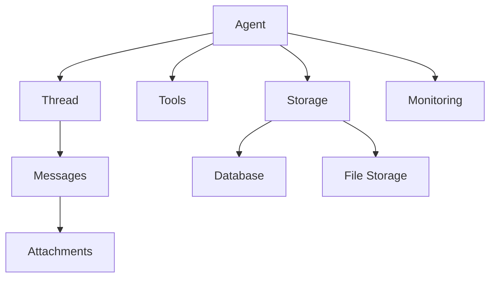

# Core Concepts

Tyler is built around several core concepts that work together to create a powerful and flexible AI agent framework. Understanding these concepts is crucial for effectively using and extending Tyler.

## Architecture Overview

Tyler's architecture is designed to be modular, extensible, and efficient:



## Core Components

### Agent

The Agent is the central component that manages conversations and executes tasks:

```python
from tyler.models.agent import Agent

agent = Agent(
    model_name="gpt-4o",
    purpose="To help with tasks"
)
```

Key features:
- Manages conversation flow
- Executes tools and processes responses
- Handles context and memory
- Tracks performance metrics

### Thread

Threads organize conversations and maintain context:

```python
from tyler.models.thread import Thread

thread = Thread(
    attributes={"source": "slack"},
    system_prompt="Custom system behavior"
)
```

Key features:
- Maintains message history
- Stores conversation context
- Supports custom attributes
- Handles system prompts

### Messages

Messages represent individual interactions within a thread:

```python
from tyler.models.message import Message

message = Message(
    role="user",
    content="What can you help me with?",
    attachments=[file_attachment]
)
```

Key features:
- Supports multiple content types
- Handles file attachments
- Tracks message metadata
- Maintains sequence order

### Attachments

Attachments handle files and media in conversations:

```python
from tyler.models.attachment import Attachment

attachment = Attachment(
    file_path="document.pdf",
    content_type="application/pdf"
)
```

Key features:
- Automatic content extraction
- Multiple storage backends
- Secure file handling
- Content processing

### Tools

Tools extend the agent's capabilities:

```python
# Standard tool
standard_tool = {
    "definition": {
        "type": "function",
        "function": {
            "name": "get_data",
            "description": "Fetch data from API",
            "parameters": {
                "type": "object",
                "properties": {
                    "query": {
                        "type": "string"
                    }
                }
            }
        }
    },
    "implementation": fetch_data_function
}

# Interrupt tool
interrupt_tool = {
    "definition": {
        "type": "function",
        "function": {
            "name": "moderate_content",
            "description": "Check content safety"
        }
    },
    "implementation": moderate_function,
    "attributes": {
        "type": "interrupt"
    }
}
```

Key features:
- Standard and interrupt tools
- Custom implementations
- Schema validation
- Error handling

## Data Flow

### Conversation Flow

1. User sends message
2. Message added to thread
3. Agent processes thread
4. Tools executed if needed
5. Response generated
6. New messages added to thread

```python
# Example conversation flow
async def conversation():
    thread = Thread()
    
    # User message
    user_msg = Message(role="user", content="Hello!")
    thread.add_message(user_msg)
    
    # Process thread
    processed_thread, new_messages = await agent.go(thread)
    
    # Handle response
    for msg in new_messages:
        if msg.role == "assistant":
            print(f"Assistant: {msg.content}")
```

### Tool Execution

1. Agent identifies tool need
2. Tool schema validated
3. Tool executed
4. Result processed
5. Response generated

```python
# Example tool execution
async def execute_tool():
    result = await agent.execute_tool(
        tool_name="get_weather",
        parameters={"location": "London"}
    )
    return result
```

## Storage and Persistence

### Database Storage

Tyler supports multiple database backends:

```python
# PostgreSQL
db = Database(db_type="postgresql")

# SQLite
db = Database(db_type="sqlite")

# In-memory
db = Database(db_type="memory")
```

### File Storage

File attachments can be stored in various backends:

```python
# Local storage
storage = FileStorage(storage_type="local")

# S3 storage
storage = FileStorage(storage_type="s3")
```

## Monitoring and Metrics

Tyler provides comprehensive monitoring:

```python
# Initialize monitoring
monitor = WeaveMonitor()

# Track metrics
monitor.track_tokens(count=150)
monitor.track_latency(seconds=0.5)
```

Key metrics:
- Token usage
- Response latency
- Tool execution time
- Error rates

## Error Handling

Tyler implements robust error handling:

```python
try:
    result = await agent.go(thread)
except TylerError as e:
    if isinstance(e, ToolExecutionError):
        # Handle tool error
        pass
    elif isinstance(e, ModelError):
        # Handle model error
        pass
    elif isinstance(e, StorageError):
        # Handle storage error
        pass
```

## Best Practices

1. **Thread Management**
   - Keep threads focused on single topics
   - Clean up old threads regularly
   - Use appropriate system prompts

2. **Tool Design**
   - Keep tools simple and focused
   - Validate inputs thoroughly
   - Handle errors gracefully
   - Document tool behavior

3. **Performance**
   - Use appropriate model sizes
   - Implement caching where possible
   - Monitor token usage
   - Optimize file processing

4. **Security**
   - Validate all inputs
   - Sanitize file content
   - Use secure storage
   - Implement rate limiting

## Next Steps

- Explore the [API Reference](./category/api-reference)
- Try the [Examples](./category/examples)
- Learn about [Advanced Features](./category/advanced-features) 