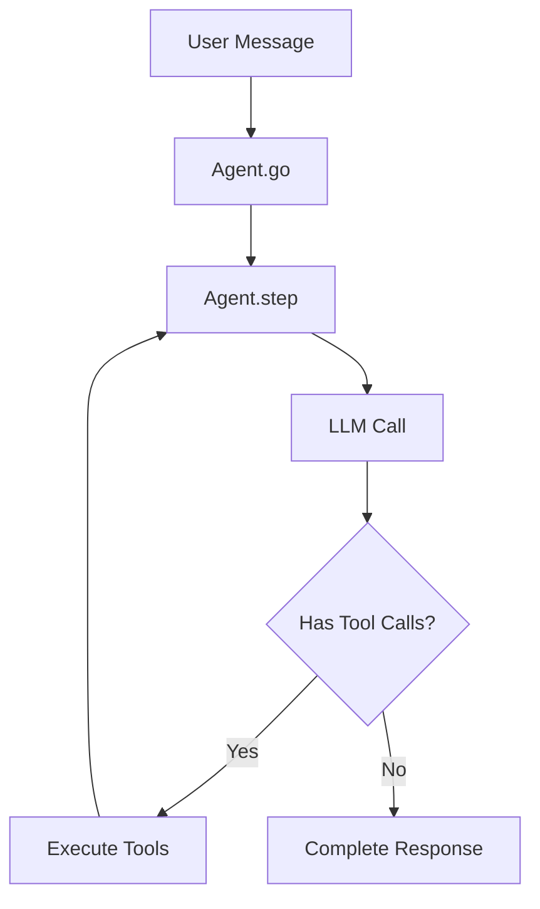
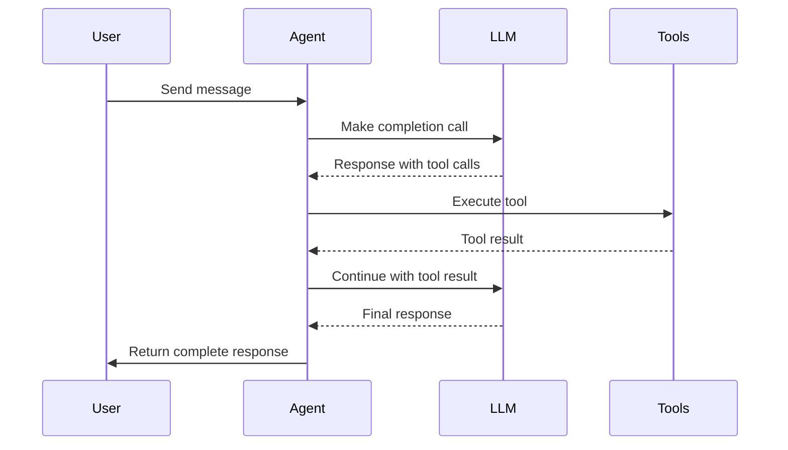

# How Tyler works

Tyler's architecture is designed to make building AI agents simple while providing all the components needed for production use. Let's dive into how Tyler processes requests and manages conversations.

## Core architecture

At its heart, Tyler uses an iterative approach to process messages and execute tools. Here's a high-level overview of how it works:

## The processing loop

When you call `agent.go()` or `go_stream()`, Tyler follows these steps:

1. **Message processing**
   - Loads the conversation thread
   - Processes any attached files (images, PDFs, etc.)
   - Ensures the system prompt is set

2. **Step execution**
   - Makes an LLM call with the current context
   - Processes the response for content and tool calls
   - Streams responses in real-time (if using `go_stream`)

3. **Tool execution**
   - If tool calls are present, executes them in sequence
   - Adds tool results back to the conversation
   - Returns to step execution if more tools are needed

4. **Completion**
   - Saves the final thread state
   - Returns the processed thread and new messages

## Example flow

Here's a typical interaction flow:

## Tool runner

Tools in Tyler are managed by the `ToolRunner`, which:

- Maintains a registry of available tools
- Handles both synchronous and asynchronous tools
- Processes tool calls from the LLM
- Returns results in a standardized format

Each tool has:
- A name and description
- Parameter definitions
- Implementation function
- Optional attributes (e.g., for special handling)

## Streaming support

When using `go_stream()`, Tyler provides real-time updates including:

- Content chunks as they arrive from the LLM
- Tool execution status and results
- Final thread state and messages

This enables building interactive interfaces where users can see the agent's thought process and tool usage in real-time.

## Error handling and limits

Tyler includes built-in safeguards:

- Maximum tool iteration limit (default: 10)
- Automatic error recovery
- Structured error responses
- Tool execution timeout handling

## Next steps

- Learn about [Configuration](./configuration.md)
- Explore available [Tools](./tools/overview.md)
- See [Examples](./category/examples) of Tyler in action 